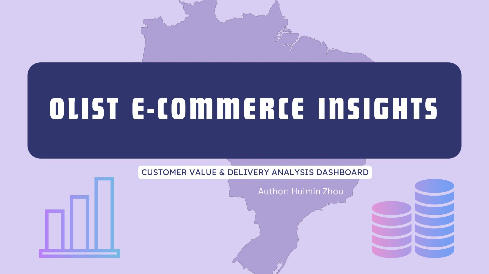
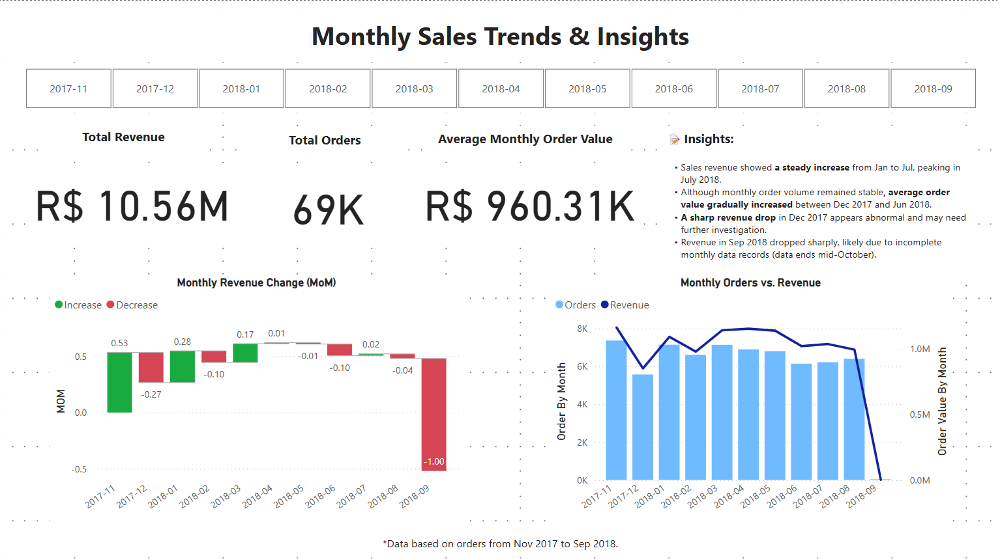
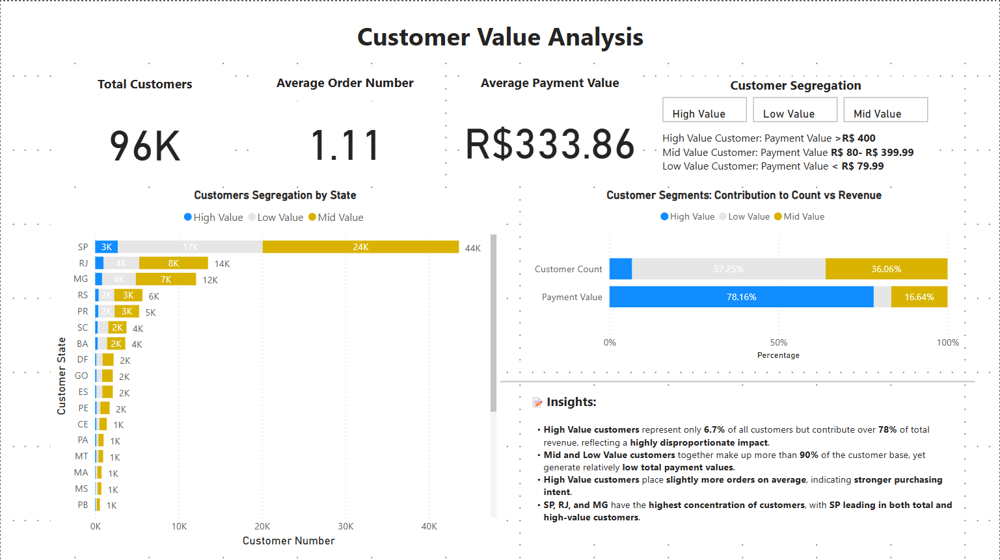
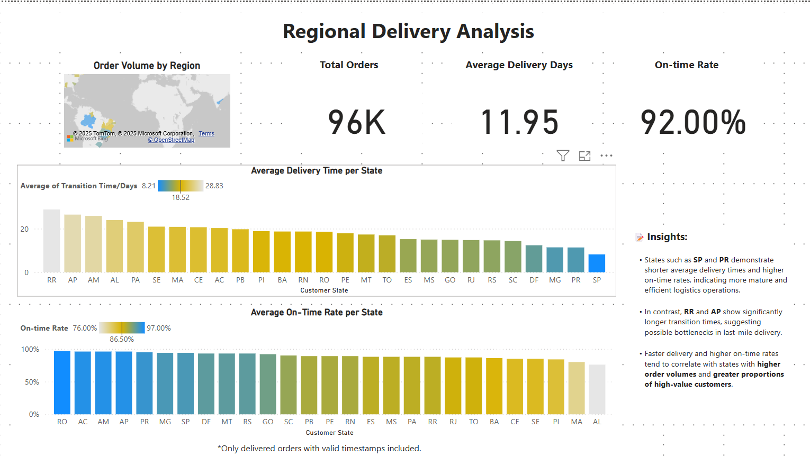
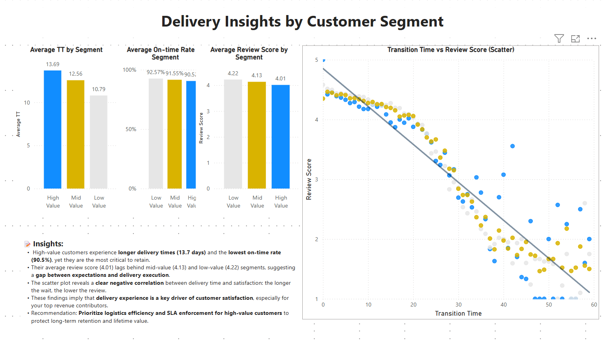

# Olist E-commerce Customer & Delivery Insights

<p align="center">
  
</p>

<h2 align="center">📦 Olist E-commerce Customer Value & Delivery Insights</h2>

<p align="center">
  A data analysis project using SQL & Power BI on Brazil's top e-commerce marketplace.
</p>


This project explores customer value, delivery performance, and satisfaction trends using real-world e-commerce data from Olist. It combines SQL-based data modeling and Power BI visualization to deliver actionable insights for business strategy.


# Olist E-commerce Customer & Delivery Insights

This project explores customer value, delivery performance, and satisfaction trends using real-world e-commerce data from Olist. It combines SQL-based data modeling and Power BI visualization to deliver actionable insights for business strategy.

---

## 📊 Dashboard Overview
The Power BI dashboard is structured into **four interactive pages**, each targeting a specific business question:

| Page | Title | Focus |
|------|-------|-------|
| 1 | Monthly Sales Trend &Analysis | Analyze monthly sales patterns and growth fluctuations |
| 2 | Customer Value Analysis | Understand how customer tiers contribute to revenue and behavior |
| 3 | Regional Delivery Performance | Evaluate delivery efficiency across Brazilian states |
| 4 | Delivery Insights by Customer Segment | Examine how delivery affects satisfaction across value tiers |

---
## 📸 Dashboard Preview

Here’s a quick look at the Power BI dashboards used in this project:

### 🧭 Page 1: Monthly Sales Trend


### 🧮 Page 2: Customer Value Segmentation


### 🚚 Page 3: Regional Delivery Performance


### 🧠 Page 4: Delivery Experience by Customer Tier


## 🗂 Project Structure
```
olist-customer-delivery-insights/
├── data/                        # Cleaned CSV data used in Power BI
├── sql/                         # SQL scripts for all analysis modules
├── insights/                    # Insight summaries (per dashboard page)
├── screenshots/                 # Power BI page visuals
├── README.md                    # Project documentation (this file)
└── Olist.pbix       # Optional Power BI file (not uploaded if private)
```

---

## 🛠 SQL Modules
| File | Description |
|------|-------------|
| `sql/monthly_sales_trend.sql` | Sales totals and month-over-month (MoM) growth analysis |
| `sql/customer_tier_analysis.sql` | Customer segmentation by spending and tier metrics |
| `sql/regional_delivery_performance.sql` | Delivery time and on-time rates by state |
| `sql/delivery_segment_analysis.sql` | Cross-tab of delivery and satisfaction by customer tier |

---
## 📄 Insight Summaries
Each dashboard page is paired with a written insight summary:

- [📄 Page 1 – Monthly Sales Insight](insights/monthly_sales_insight.md): Sales cycles and seasonal variation
- [📄 Page 2 – Customer Value Insight](insights/customer_value_insights.md): Tier contribution and value structure
- [📄 Page 3 – Regional Delivery Insight](insights/regional_delivery_performance_insights.md): Regional delivery gap detection
- [📄 Page 4 – Delivery Segment Insight](insights/delivery_segment_insights.md): Service experience of high-value customers


---

## 💡 Key Takeaways
- A small group（6.7%) of **high-value customers** generates nearly **80% of revenue**, but faces longer delivery and lower satisfaction.
- Delivery performance varies widely across Brazilian states, revealing strategic opportunities for logistics improvement.
- Monthly revenue trends suggest **seasonal fluctuation** and highlight months for potential campaign optimization.

---

## ⚙️ Tech Stack
- **Google BigQuery / Standard SQL** – Aggregation, filtering, time-based analysis
- **Power BI** – Data modeling, visuals, KPI tracking
- **Markdown / GitHub** – Project documentation and sharing

---

## 📥 Data Source
This project uses the public **Olist Brazilian E-Commerce Dataset**, available from Kaggle.

> [📦 View on Kaggle](https://www.kaggle.com/datasets/olistbr/brazilian-ecommerce)

---

## 📬 Author
Made with ❤️ by **Huimin Zhou (Amy~)**  
Aspiring data analyst with a background in procurement, international business development, and a focus on e-commerce.

- 🌐 [LinkedIn]https://www.linkedin.com/in/zhou-huimin-548245134/
- 💻 [GitHub]https://github.com/Amy11248
